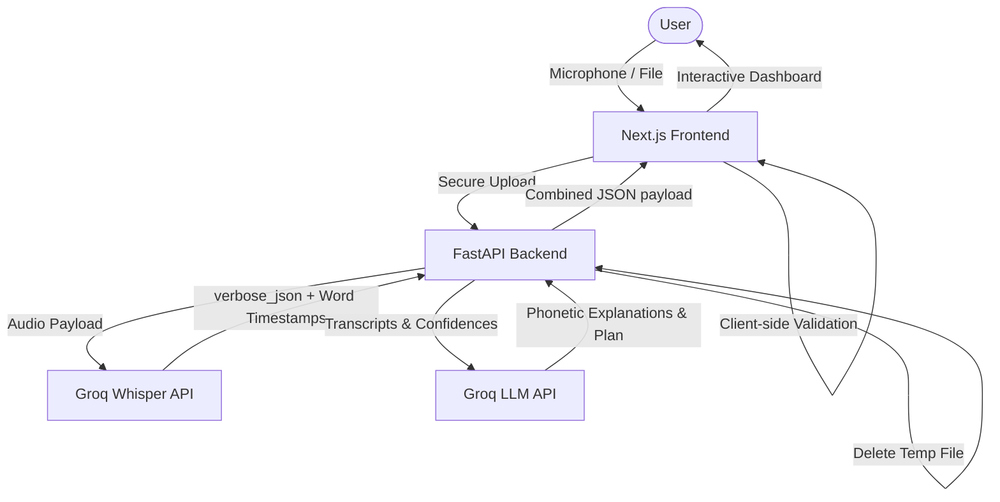

# LivoSpeak AI 🎙️✨
> **Intelligent English Pronunciation & Speaking Coach (MVP 1.0)**

LivoSpeak AI is an intelligent, privacy-first web application designed to help English learners evaluate and refine their pronunciation, clarity, and fluency. By uploading or recording a 30–45 second speech sample, users receive instant, actionable, and explainable phonetic feedback.

---

## 🌟 Key Features

1. **Dual Audio Input**:
   - **File Upload**: Drag-and-drop or browse standard audio files (`MP3`, `WAV`, `M4A`, `WebM`, `OGG`).
   - **Microphone Recorder**: Record directly in the browser with a live 30–45s timer and progress ring.

2. **Pre-Flight Validation**:
   - **Client-Side**: Immediate check of file size and duration before upload to prevent unnecessary server requests.
   - **Server-Side**: Robust validation via FFmpeg (`ffprobe`) ensuring strict 30–45s recording bounds.

3. **Analytics Dashboard**:
   - **Overall Score**: Visual circular progress ring with gradient state indicators.
   - **Sub-Category Metrics**: Pronunciation Accuracy, Fluency, Clarity, and Model Confidence with helpful tooltip explanations.

4. **Interactive Transcript & Audio Snippet Playback**:
   - Every transcribed word is clickable.
   - **"Listen to Yourself"**: Clicking any word plays the exact segment from your recording using client-side slicing (`start`/`end` timestamps).
   - Low confidence words are underlined with a wavy red highlight.

5. **"Explain Why" Phonetic Drawer**:
   - Clicking any flagged word displays a linguistic breakdown:
     - Specific issue (e.g. *Missing middle syllable*).
     - Expected pronunciation in standard **IPA notation** (e.g. ` /ˈkʌmf.tə.bəl/`).
     - **Why it matters** (phonetic explanation).
     - Targeted practice phrases.

6. **AI Coaching Engine**:
   - Summary of **Strengths**, **Weaknesses**, and **Actionable Advice** from Groq LLM.

7. **5-Minute Daily Study Plan Checklist**:
   - Interactive checklist containing vocal warm-ups, vocabulary drills, speaking sentences, and tongue twisters.

8. **Privacy First (DPDP Compliant)**:
   - Audio is parsed in-memory or in secure temporary directories.
   - Files are permanently deleted immediately after processing is complete.

9. **Seamless Developer Experience**:
   - **High-Fidelity Mock Mode**: The backend automatically falls back to standard mock datasets if no `GROQ_API_KEY` is provided, enabling instant local testing.

---

## 🏗️ Architecture & Technology Stack

The project is structured as a full-stack application:



- **Frontend**: Next.js 15 (App Router), TypeScript, Tailwind CSS, Lucide Icons.
- **Backend**: FastAPI, Uvicorn, Pydantic (data schemas), python-multipart, python-dotenv.
- **Audio Utility**: FFmpeg (`ffprobe` binary).
- **AI Pipelines**:
  - **Speech-to-Text**: Groq Whisper API (`whisper-large-v3`).
  - **Pronunciation Coach**: Groq LLM API (`llama-3.3-70b-specdec`).

---

## 📁 Repository Structure

```text
livospeak/
├── backend/
│   ├── app/
│   │   ├── services/
│   │   │   ├── audio.py        # FFmpeg file/duration validation
│   │   │   ├── groq_service.py # Whisper transcription & LLM generation
│   │   │   └── analyzer.py     # Metrics math & coordination
│   │   ├── schemas/
│   │   │   └── analysis.py     # Pydantic response models
│   │   ├── config.py           # Environment config
│   │   └── main.py             # FastAPI router, CORS, and cleanup
│   ├── .env                    # Local credentials
│   ├── requirements.txt        # Backend dependencies
│   └── test_35s.wav            # Silent 35s test file
├── frontend/
│   ├── src/
│   │   └── app/
│   │       ├── globals.css     # Tailwind imports, custom animations & styles
│   │       ├── layout.tsx      # SEO metadata
│   │       └── page.tsx        # High-fidelity dashboard application
│   ├── package.json
│   └── tsconfig.json
└── README.md                   # Documentation (this file)
```

---

## 🚀 Getting Started

### 1. Prerequisites
- Python 3.10+
- Node.js 18+
- **FFmpeg** installed on your system.

### 2. Backend Setup
1. Navigate to the backend folder:
   ```bash
   cd backend
   ```
2. Create and activate a virtual environment:
   ```bash
   python3 -m venv venv
   source venv/bin/activate
   ```
3. Install dependencies:
   ```bash
   pip install -r requirements.txt
   ```
4. Create a `.env` file in the `backend/` directory:
   ```env
   GROQ_API_KEY=your_groq_api_key_here
   ```
   *(Note: If `GROQ_API_KEY` is left blank, the app will run in **Mock Mode**, providing high-fidelity mock reports for validation).*
5. Start the backend dev server:
   ```bash
   uvicorn app.main:app --host 127.0.0.1 --port 8000 --reload
   ```

### 3. Frontend Setup
1. Open a new terminal and navigate to the frontend folder:
   ```bash
   cd frontend
   ```
2. Install npm packages:
   ```bash
   npm install
   ```
3. Run the Next.js dev server:
   ```bash
   npm run dev
   ```
4. Open [http://localhost:3000](http://localhost:3000) in your browser.

---

## 🧪 Testing the API
We have generated a 35-second silent test file in the backend directory. You can test the API endpoint directly by running:
```bash
curl -X POST -F "file=@test_35s.wav" http://127.0.0.1:8000/api/analyze
```
You will receive a complete JSON speech analysis response payload.
